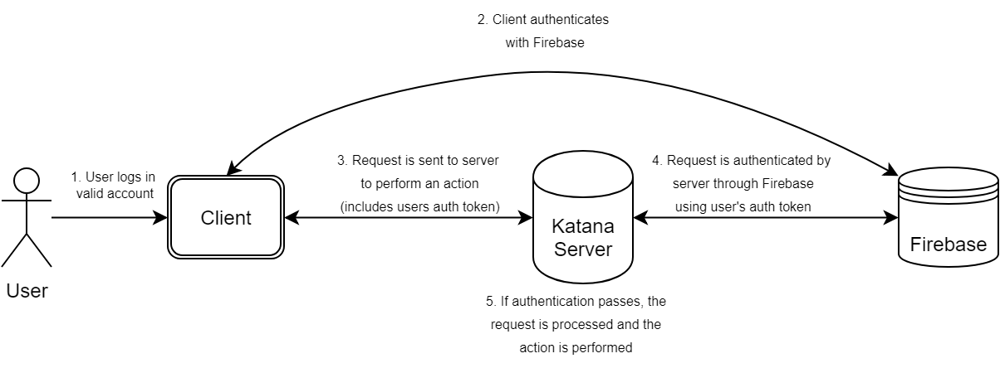

# Firebase Authentication Process

Katana uses Firebase authentication services, although this may be temporary. As it stands, a developer key is not available to the team working on the Katana project. As an alternative, which coincedently opens up several new opportunities by integrating with Google authentication, Katana uses Firebase authentication with *only* Google Accounts allowed. Users cannot create new accounts, and must use an existing Google account. It must be a **BYUI G-Suite Account**, or their google account will be removed from Katana instantaneously.

## Sign-Up Process

When a user accesses Katana for the first time, they will be redirected to a Google login page. It will allow them to log in with any google account, but it will keep looping them back to the login page if they use a standard gmail or non-BYUI google account. After successfully logging into a valid BYUI google account, they will be taken back to Katana, where they will be automatically logged in.

However, they cannot access the tool quite yet. It may continue to loop them back to the Google login page, even with a BYUI Google account. This is because all accounts are automatically disabled on creation (see below). This helps prevent unwanted users from accessing it without being given access manually. An admin [must enable their account](../processes/enabling-accounts-on-firebase.html) before they can continue.

## Authentication Process

Below is a diagram with a simple overview of the authentication process using Firebase. This is the flow *after* the user has successfully signed up with a valid account. 

