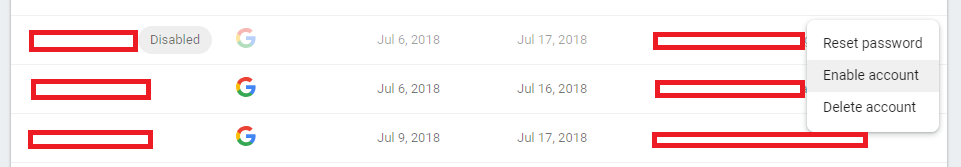

# Enabling an account (Firebase Admins Only)

New, valid account added to Firebase are disabled automatically by the [Firebase Functions](../firebase/firebase-functions.html) (if set up on your firebase instance).

To enable an account:

1. Navigate to the [Firebase Console](https://console.firebase.google.com/u/0/)
2. Log in with a valid account that has admin access to your Katana firebase project
3. Select the Katana firebase project from the available projects
4. Select the "Authentication" tab under the *Develop* menu on the left
5. Select the "Users" tab on the Authentication page
6. Find the user you want to enable and select the Kebob menu on the right side of their row
7. Select "Enable Account"

 
(Selecting the Authentication Tab)

 
(Enabling an Account)

