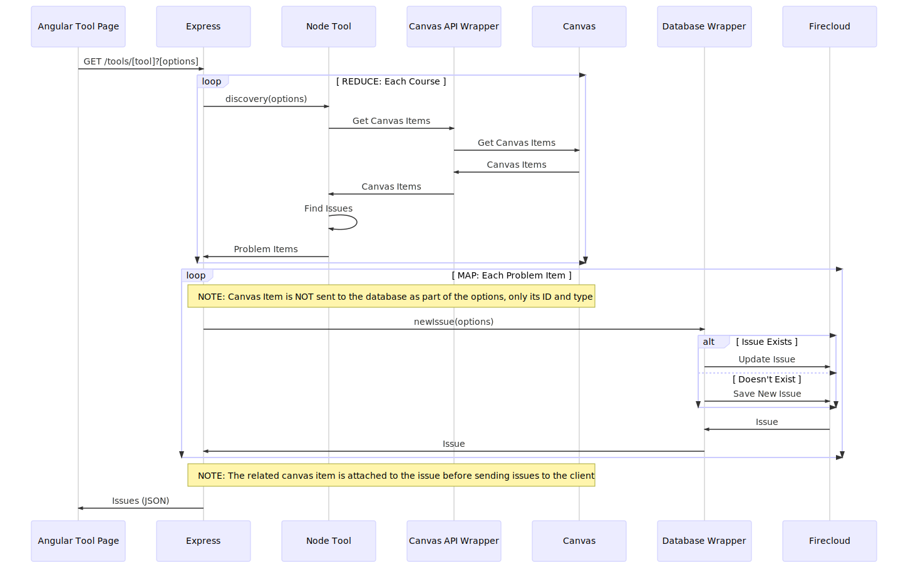
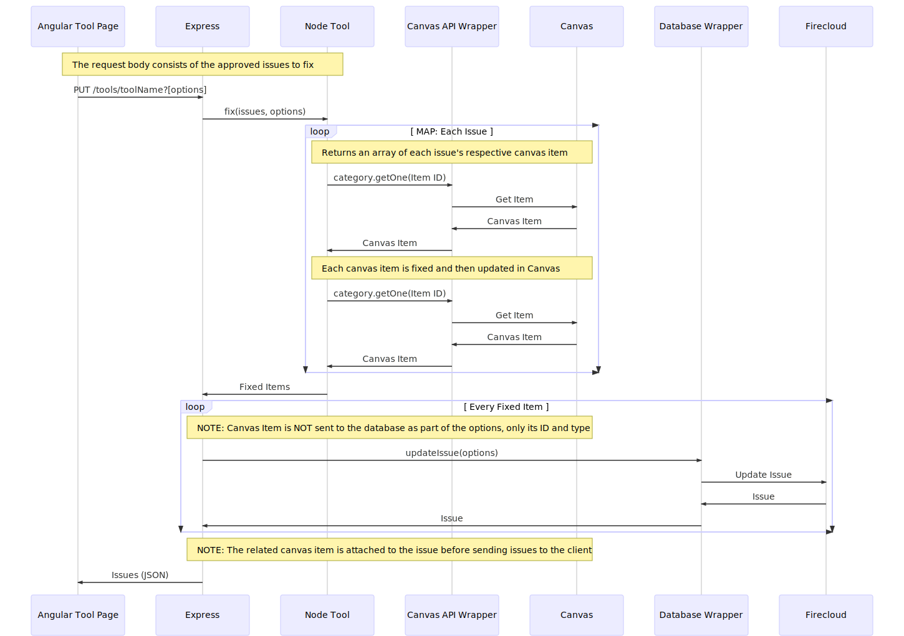

# Node Tools

## Discover Issues

When a tool page is loading on the client, the tool on the express server needs to discover issues in the selected courses. This is the sequence used to discover those issues:

[Mermaid Editor: Discovering Issues](https://mermaidjs.github.io/mermaid-live-editor/#/edit/eyJjb2RlIjoic2VxdWVuY2VEaWFncmFtXG5wYXJ0aWNpcGFudCBBIGFzIEFuZ3VsYXIgVG9vbCBQYWdlXG5wYXJ0aWNpcGFudCBFIGFzIEV4cHJlc3NcbnBhcnRpY2lwYW50IE5UIGFzIE5vZGUgVG9vbFxucGFydGljaXBhbnQgU0RLIGFzIENhbnZhcyBBUEkgV3JhcHBlclxucGFydGljaXBhbnQgQyBhcyBDYW52YXNcbnBhcnRpY2lwYW50IERXIGFzIERhdGFiYXNlIFdyYXBwZXJcbnBhcnRpY2lwYW50IEYgYXMgRmlyZWNsb3VkXG5cbiMgVE9PTCAtIEdFVCBJU1NVRVNcblxuQSAtPj4gRTogR0VUIC90b29scy9bdG9vbF0_W29wdGlvbnNdXG5cbmxvb3AgUkVEVUNFOiBFYWNoIENvdXJzZVxuRSAtPj4gTlQ6IGRpc2NvdmVyeShvcHRpb25zKVxuTlQgLT4-IFNESyA6IEdldCBDYW52YXMgSXRlbXNcblNESyAtPj4gQzogR2V0IENhbnZhcyBJdGVtc1xuQyAtPj4gU0RLIDogQ2FudmFzIEl0ZW1zXG5TREsgLT4-IE5UOiBDYW52YXMgSXRlbXNcbk5UIC0-PiBOVDogRmluZCBJc3N1ZXNcbk5UIC0-PiBFOiBQcm9ibGVtIEl0ZW1zXG5lbmRcblxubG9vcCBNQVA6IEVhY2ggUHJvYmxlbSBJdGVtXG5ub3RlIG92ZXIgRSwgQzogTk9URTogQ2FudmFzIEl0ZW0gaXMgTk9UIHNlbnQgdG8gdGhlIGRhdGFiYXNlIGFzIHBhcnQgb2YgdGhlIG9wdGlvbnMsIG9ubHkgaXRzIElEIGFuZCB0eXBlXG5FIC0-PiBEVzogbmV3SXNzdWUob3B0aW9ucylcbmFsdCBJc3N1ZSBFeGlzdHNcbkRXIC0-PiBGOiBVcGRhdGUgSXNzdWVcbmVsc2UgRG9lc24ndCBFeGlzdFxuRFcgLT4-IEY6IFNhdmUgTmV3IElzc3VlXG5lbmRcbkYgLT4-IERXOiBJc3N1ZVxuRFcgLT4-IEU6IElzc3VlXG5lbmRcbm5vdGUgb3ZlciBFLCBDOiBOT1RFOiBUaGUgcmVsYXRlZCBjYW52YXMgaXRlbSBpcyBhdHRhY2hlZCB0byB0aGUgaXNzdWUgYmVmb3JlIHNlbmRpbmcgaXNzdWVzIHRvIHRoZSBjbGllbnRcbkUgLT4-IEE6IElzc3VlcyAoSlNPTilcblxuIiwibWVybWFpZCI6eyJ0aGVtZSI6ImRlZmF1bHQifX0)

## Fix Issues

After a tool has discovered all available issues, the user approves which ones should be fixed by the tool. This sequence occurs when the user has approved fixes, and then submits them to be fixed:

[Mermaid Editor: Fix Issues](https://mermaidjs.github.io/mermaid-live-editor/#/edit/eyJjb2RlIjoic2VxdWVuY2VEaWFncmFtXG5wYXJ0aWNpcGFudCBBIGFzIEFuZ3VsYXIgVG9vbCBQYWdlXG5wYXJ0aWNpcGFudCBFIGFzIEV4cHJlc3NcbnBhcnRpY2lwYW50IE5UIGFzIE5vZGUgVG9vbFxucGFydGljaXBhbnQgU0RLIGFzIENhbnZhcyBBUEkgV3JhcHBlclxucGFydGljaXBhbnQgQyBhcyBDYW52YXNcbnBhcnRpY2lwYW50IERXIGFzIERhdGFiYXNlIFdyYXBwZXJcbnBhcnRpY2lwYW50IEYgYXMgRmlyZWNsb3VkXG5cbiMgVE9PTCAtIEdFVCBJU1NVRVNcblxubm90ZSBvdmVyIEEsIE5UOiBUaGUgcmVxdWVzdCBib2R5IGNvbnNpc3RzIG9mIHRoZSBhcHByb3ZlZCBpc3N1ZXMgdG8gZml4XG5BIC0-PiBFOiBQVVQgL3Rvb2xzL3Rvb2xOYW1lP1tvcHRpb25zXVxuRSAtPj4gTlQ6IGZpeChpc3N1ZXMsIG9wdGlvbnMpXG5cbmxvb3AgTUFQOiBFYWNoIElzc3VlXG5ub3RlIG92ZXIgTlQsIEM6IEVhY2ggaXNzdWUncyBhc3NvY2lhdGVkIENhbnZhcyBpdGVtIGlzIHJldHJpZXZlZFxuTlQgLT4-IFNESzogY2F0ZWdvcnkuZ2V0T25lKEl0ZW0gSUQpXG5TREsgLT4-IEM6IEdldCBJdGVtXG5DIC0-PiBTREs6IENhbnZhcyBJdGVtXG5TREsgLT4-IE5UOiBDYW52YXMgSXRlbVxubm90ZSBvdmVyIE5ULCBDOiBFYWNoIGNhbnZhcyBpdGVtIGlzIGZpeGVkXG5OVCAtPj4gTlQ6IEZpeCBJdGVtXG5ub3RlIG92ZXIgTlQsIEM6IEVhY2ggY2FudmFzIGl0ZW0gaXMgdXBkYXRlZCBpbiBDYW52YXNcbk5UIC0-PiBTREs6IGNhdGVnb3J5LmdldE9uZShJdGVtIElEKVxuU0RLIC0-PiBDOiBHZXQgSXRlbVxuQyAtPj4gU0RLOiBDYW52YXMgSXRlbVxuU0RLIC0-PiBOVDogQ2FudmFzIEl0ZW1cbmVuZFxuXG5OVCAtPj4gRTogRml4ZWQgSXRlbXNcblxubG9vcCBFdmVyeSBGaXhlZCBJdGVtXG5ub3RlIG92ZXIgRSwgQzogTk9URTogQ2FudmFzIEl0ZW0gaXMgTk9UIHNlbnQgdG8gdGhlIGRhdGFiYXNlIGFzIHBhcnQgb2YgdGhlIG9wdGlvbnMsIG9ubHkgaXRzIElEIGFuZCB0eXBlXG5FIC0-PiBEVzogdXBkYXRlSXNzdWUob3B0aW9ucylcbkRXIC0-PiBGOiBVcGRhdGUgSXNzdWVcbkYgLT4-IERXOiBJc3N1ZVxuRFcgLT4-IEU6IElzc3VlXG5lbmRcbm5vdGUgb3ZlciBFLCBDOiBOT1RFOiBUaGUgcmVsYXRlZCBjYW52YXMgaXRlbSBpcyBhdHRhY2hlZCB0byB0aGUgaXNzdWUgYmVmb3JlIHNlbmRpbmcgaXNzdWVzIHRvIHRoZSBjbGllbnRcbkUgLT4-IEE6IElzc3VlcyAoSlNPTilcblxuIiwibWVybWFpZCI6eyJ0aGVtZSI6ImRlZmF1bHQifX0)
